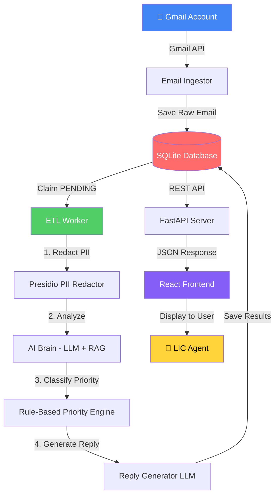

# LIC Email Intelligence Platform - Complete System Workflow

This document provides a comprehensive overview of how the entire LIC Email Intelligence Platform works, from email ingestion to automated reply generation.

---

## System Architecture Overview



---

## Component Breakdown

### 1️⃣ **Email Ingestor** ([gmail_fetcher.py](file:///c:/Users/KHAN/.gemini/antigravity/scratch/lic-platform/backend/app/gmail_fetcher.py))

**Purpose**: Fetch emails from configured Gmail accounts using Gmail API

**Authentication Methods**:
- OAuth 2.0 (user login)
- Service Account (admin access)
- Access Token (pre-generated)

**Process**:
1. Authenticate with Gmail API using stored credentials
2. Fetch unread emails (maximum 50 per sync)
3. Parse email metadata (sender, subject, body, timestamp)
4. Save to database as `PENDING` status
5. Runs every **5 minutes** automatically

**Key Functions**:
- `GmailAuthenticator` - Handles authentication with automatic token refresh
- `GmailFetcher.get_unread_emails()` - Fetches and parses emails
- `sync_all_gmail_accounts()` - Syncs all enabled accounts

---

### 2️⃣ **ETL Worker** ([worker.py](file:///c:/Users/KHAN/.gemini/antigravity/scratch/lic-platform/backend/app/worker.py))

**Purpose**: Background processing loop that transforms raw emails into actionable intelligence

**Main Loop** (`start_loop()`):
```python
while True:
    # Every 5 minutes: Sync Gmail accounts
    sync_all_gmail_accounts()
    
    # Continuously: Process pending emails
    process_email()
```

**Email Processing Pipeline** (`process_email()`):

#### **Step 1: PII Redaction** → [privacy.py](file:///c:/Users/KHAN/.gemini/antigravity/scratch/lic-platform/backend/app/privacy.py)
```python
redacted_body = redact_pii(original_body)
```
- Uses **Presidio Analyzer** to detect PII entities
- Replaces with `[REDACTED]`
- Entities detected: phone numbers, emails, names, credit cards, SSN, IP addresses

#### **Step 2: AI Analysis** → [brain.py](file:///c:/Users/KHAN/.gemini/antigravity/scratch/lic-platform/backend/app/brain.py)
```python
analysis_result = analyze_email(redacted_body)
```
Returns:
- `intent` - Email classification (GENERAL_ENQUIRY, REQUEST, COMPLAINT, etc.)
- `sentiment` - POSITIVE, NEUTRAL, or NEGATIVE
- `summary` - Brief description of email content
- `confidence` - High, Medium, or Low

**How it works**:
- Uses **LangChain + Ollama** (local LLM)
- Performs **RAG (Retrieval Augmented Generation)**
- Retrieves relevant context from knowledge base
- Generates structured analysis in JSON format

#### **Step 3: Priority Classification** → [priority.py](file:///c:/Users/KHAN/.gemini/antigravity/scratch/lic-platform/backend/app/priority.py)
```python
priority, reason = compute_priority(intent, sentiment, summary, redacted_body)
```
Returns: `HIGH`, `MEDIUM`, or `LOW`

**Rule-Based Logic**:
- **HIGH**: Complaints, claims, payment issues, fraud, legal matters
- **MEDIUM**: General requests, document submissions
- **LOW**: Inquiries, appreciation, informational emails

#### **Step 4: Auto-Reply Generation** → [reply.py](file:///c:/Users/KHAN/.gemini/antigravity/scratch/lic-platform/backend/app/reply.py)
```python
generated_reply = generate_reply(redacted_body, intent, priority, confidence, sentiment)
```

**5-Layer Safety System**:
1. ✋ **Entry Conditions**: Block HIGH priority, restricted intents, low confidence
2. 🚫 **Hard Keyword Block**: Always block risky terms (claim, payment, refund, etc.)
3. ⚠️ **Soft Indicator + Risk**: Block if urgency + negative sentiment
4. 📝 **Pattern Selection**: Map intent to approved response templates
5. ✅ **Post-Validation**: Scan generated reply for forbidden terms

**Approved Response Patterns**:
- `GENERAL_ENQUIRY` → "Thank you for your query..."
- `REQUEST` → "Thank you for contacting LIC..."
- `APPRECIATION` → "Thank you for your feedback..."

**Returns**: Either the approved pattern OR `NO_REPLY` (requires human handling)

#### **Step 5: Save Results**
```python
update_email_analysis(
    email_id=email['id'],
    redacted_body=redacted_body,
    analysis=analysis_result,
    suggested_action=summary,
    generated_reply=generated_reply,
    status='COMPLETED'
)
```

---

### 3️⃣ **Database** ([database.py](file:///c:/Users/KHAN/.gemini/antigravity/scratch/lic-platform/backend/app/database.py))

**Technology**: SQLite (local, no cloud dependencies)

**Main Tables**:
- `emails` - Stores raw and processed emails
- `gmail_config` - Gmail account credentials
- `documents` - RAG knowledge base

**Email Status Flow**:
```
PENDING → PROCESSING → COMPLETED/FAILED
```

**Key Functions**:
- `claim_next_pending_email()` - Atomically claims email for processing (prevents duplicates)
- `update_email_analysis()` - Saves all processing results
- `bulk_save_emails()` - Batch insert for Gmail sync

---

### 4️⃣ **API Server** ([api.py](file:///c:/Users/KHAN/.gemini/antigravity/scratch/lic-platform/backend/app/api.py))

**Framework**: FastAPI (async, high-performance)

**Main Endpoints**:

| Endpoint | Method | Purpose |
|----------|--------|---------|
| `/emails/history` | GET | Retrieve processed emails (paginated) |
| `/emails/stats` | GET | Dashboard statistics |
| `/rag/ingest` | POST | Upload documents to knowledge base |
| `/rag/status` | GET | RAG system status |
| `/gmail/accounts` | GET | List Gmail configurations |
| `/gmail/accounts` | POST | Add new Gmail account |
| `/gmail/sync` | POST | Trigger manual Gmail sync |

**CORS Enabled**: Frontend can connect from `http://localhost:5173`

---

### 5️⃣ **Frontend** (React + Vite)

**Pages**:
- **Dashboard** - Overview statistics
- **Email History** - Paginated email list with filters
- **Gmail Configuration** - Manage Gmail accounts
- **RAG Management** - Upload knowledge base documents

**Real-time Updates**: Polls backend API for status changes

---

## Complete Data Flow Example

### **Scenario**: Customer sends email about policy inquiry

```
┌─────────────────────────────────────────────────────────────────┐
│ 1. EMAIL ARRIVES                                                 │
│ From: customer@example.com                                       │
│ Subject: Policy Premium Question                                │
│ Body: "Hi, my name is John Doe (555-1234).                      │
│        When is the premium due for policy ABC123?"              │
└─────────────────────────────────────────────────────────────────┘
                            ↓
┌─────────────────────────────────────────────────────────────────┐
│ 2. GMAIL INGESTOR (Every 5 minutes)                             │
│ - Fetches email via Gmail API                                   │
│ - Saves to database with status=PENDING                         │
└─────────────────────────────────────────────────────────────────┘
                            ↓
┌─────────────────────────────────────────────────────────────────┐
│ 3. WORKER CLAIMS EMAIL                                           │
│ - claim_next_pending_email() → Returns email                    │
│ - Status changes: PENDING → PROCESSING                          │
└─────────────────────────────────────────────────────────────────┘
                            ↓
┌─────────────────────────────────────────────────────────────────┐
│ 4. PII REDACTION (Presidio)                                     │
│ Before: "my name is John Doe (555-1234)"                        │
│ After: "my name is [REDACTED] ([REDACTED])"                     │
└─────────────────────────────────────────────────────────────────┘
                            ↓
┌─────────────────────────────────────────────────────────────────┐
│ 5. AI ANALYSIS (LLM + RAG)                                      │
│ Input: Redacted email body                                      │
│ Output:                                                          │
│   • intent: "GENERAL_ENQUIRY"                                   │
│   • sentiment: "NEUTRAL"                                        │
│   • summary: "Customer asking about premium due date"           │
│   • confidence: "High"                                          │
└─────────────────────────────────────────────────────────────────┘
                            ↓
┌─────────────────────────────────────────────────────────────────┐
│ 6. PRIORITY CLASSIFICATION (Rules)                              │
│ Input: intent=GENERAL_ENQUIRY, sentiment=NEUTRAL                │
│ Output: priority="LOW"                                          │
│ Reason: "General inquiry with neutral sentiment"                │
└─────────────────────────────────────────────────────────────────┘
                            ↓
┌─────────────────────────────────────────────────────────────────┐
│ 7. REPLY GENERATION (Multi-Layer Safety)                        │
│ ✅ Priority check: LOW (pass)                                   │
│ ✅ Intent check: GENERAL_ENQUIRY (safe)                         │
│ ✅ Confidence: High (pass)                                      │
│ ✅ Hard keywords: None detected                                 │
│ ✅ Pattern selection: PATTERN_B                                 │
│                                                                  │
│ Generated Reply:                                                 │
│ "Thank you for your query.                                      │
│  Our team is reviewing the information and will respond         │
│  with the relevant details."                                    │
└─────────────────────────────────────────────────────────────────┘
                            ↓
┌─────────────────────────────────────────────────────────────────┐
│ 8. SAVE TO DATABASE                                             │
│ - redacted_body: Stored                                         │
│ - analysis: Full JSON saved                                     │
│ - priority: "LOW"                                               │
│ - generated_reply: Stored                                       │
│ - status: COMPLETED                                             │
└─────────────────────────────────────────────────────────────────┘
                            ↓
┌─────────────────────────────────────────────────────────────────┐
│ 9. FRONTEND DISPLAY                                             │
│ API call: GET /emails/history                                   │
│ User sees:                                                       │
│   📧 Policy Premium Question                                    │
│   🟢 LOW Priority                                               │
│   💬 "Customer asking about premium due date"                   │
│   ✉️ Suggested Reply: [View]                                    │
└─────────────────────────────────────────────────────────────────┘
                            ↓
┌─────────────────────────────────────────────────────────────────┐
│ 10. HUMAN REVIEW                                                │
│ LIC Agent reviews:                                              │
│ - Original email (PII redacted for display)                     │
│ - AI analysis and priority                                      │
│ - Suggested reply                                               │
│                                                                  │
│ Agent can:                                                       │
│ • Approve and send reply                                        │
│ • Modify reply before sending                                   │
│ • Handle manually if AI suggests NO_REPLY                       │
└─────────────────────────────────────────────────────────────────┘
```

---

## Technology Stack

### **Backend**
- **Python 3.10+** - Core language
- **FastAPI** - REST API framework
- **SQLite** - Database
- **LangChain** - LLM orchestration
- **Ollama** - Local LLM runtime (gemma2:2b model)
- **Presidio** - PII detection and anonymization
- **ChromaDB** - Vector database for RAG

### **Frontend**
- **React 18** - UI framework
- **Vite** - Build tool
- **TailwindCSS** - Styling
- **Axios** - HTTP client

### **AI/ML**
- **Local LLM**: gemma2:2b (runs via Ollama)
- **Embeddings**: Sentence Transformers
- **RAG**: ChromaDB vector store

---

## Key Design Principles

### 🔒 **Privacy-First**
- PII redacted **before** any AI processing
- Original email bodies stored separately
- Fail-closed: If redaction fails, processing stops

### 🎯 **Hybrid AI + Rules**
- **AI provides context** (intent, sentiment, summary)
- **Rules make decisions** (priority, reply generation)
- Deterministic, auditable, explainable

### 🚫 **Safety by Design**
- Multiple validation layers for reply generation
- Hard blocks for risky keywords
- Post-generation validation
- Returns NO_REPLY for uncertain cases

### 🏠 **On-Premise**
- No cloud dependencies
- All data stays local
- Works offline (except Gmail sync)

### ⚡ **Scalable Architecture**
- Worker uses exponential backoff
- Atomic email claiming (prevents race conditions)
- Can run multiple workers in parallel

---

## Configuration Files

### **Backend** (`backend/run.py`)
```python
# Starts both API server and Worker
uvicorn.run(api_app)  # Port 8000
worker.start_loop()   # Background processing
```

### **Frontend** (`frontend/package.json`)
```json
{
  "scripts": {
    "dev": "vite",  // Port 5173
    "build": "vite build"
  }
}
```

### **Environment Variables**
- Ollama endpoint: `http://localhost:11434` (default)
- Database path: `backend/data/emails.db`
- RAG documents: `backend/data/knowledge_base/`

---

## Running the System

### **Prerequisites**
1. Ollama installed and running
2. Python 3.10+ with dependencies
3. Node.js 18+ with npm

### **Start Commands**
```bash
# Terminal 1: Backend (API + Worker)
cd backend
python run.py

# Terminal 2: Frontend
cd frontend
npm run dev
```

### **Access Points**
- Frontend: http://localhost:5173
- API Docs: http://localhost:8000/docs
- Health Check: http://localhost:8000/health

---

## Workflow Summary

| Stage | Component | Input | Output | Duration |
|-------|-----------|-------|--------|----------|
| **Ingestion** | Gmail Fetcher | Gmail API | Raw emails in DB | ~5-10s per account |
| **Claiming** | Worker | PENDING emails | PROCESSING status | <1ms |
| **Redaction** | Presidio | Raw email body | PII-free text | ~100-500ms |
| **Analysis** | LLM + RAG | Redacted text | Intent, sentiment, summary | ~2-5s |
| **Priority** | Rule Engine | AI context | HIGH/MEDIUM/LOW | <10ms |
| **Reply** | LLM + Rules | All context | Draft or NO_REPLY | ~1-3s |
| **Storage** | Database | All results | COMPLETED status | ~50ms |
| **Display** | API + Frontend | Database query | User interface | ~100-200ms |

**Total Processing Time**: 3-10 seconds per email

---

## Monitoring & Logging

All components log to:
- **Console output** (real-time)
- **app.log** file (persistent)

**Log Format**:
```
2026-01-29 14:43:24 - Worker - INFO - Processing Email ID: 123
2026-01-29 14:43:25 - Privacy - INFO - Redacted 2 PII entities
2026-01-29 14:43:27 - Brain - INFO - Analysis complete: GENERAL_ENQUIRY
2026-01-29 14:43:27 - Priority - INFO - Priority: LOW (General inquiry)
2026-01-29 14:43:28 - ReplyGenerator - INFO - Reply generated: PATTERN_B
```

---

## Future Enhancements

- [ ] Multi-language support
- [ ] Email threading/conversation tracking
- [ ] Advanced analytics dashboard
- [ ] Custom reply templates per intent
- [ ] Integration with ticketing systems
- [ ] Automated reply sending (with approval workflow)
